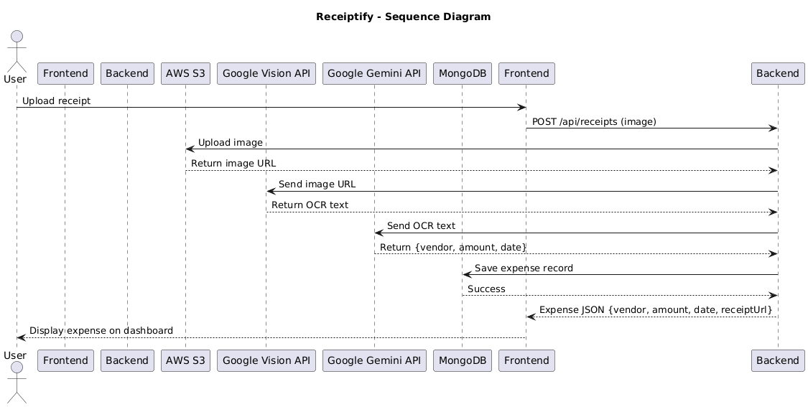
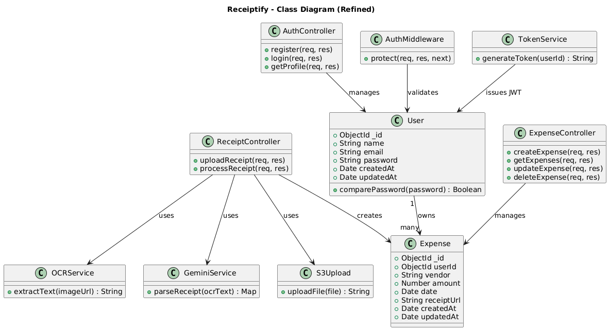

# 📌 Receiptify – Automated Expense Tracker

Receiptify is a **full-stack expense tracker** that extracts and structures data from uploaded receipts using **OCR** and **AI**. With a secure, cloud-first architecture, it simplifies expense management for users by automating receipt processing.

---

## ✨ Features

* 🔐 **Secure Authentication** – JWT with httpOnly cookies
* ☁️ **Cloud Storage** – Receipt images stored securely on AWS S3
* 👁 **OCR Extraction** – Google Cloud Vision API extracts raw text from receipts
* 🤖 **AI-Powered Parsing** – Google Gemini API converts OCR text into structured fields (vendor, amount, date)
* 📊 **Expense Management** – Full CRUD operations for expenses
* 🛡 **Production-Grade Security** – Helmet, CORS, rate limiting, secure headers
* ✅ **Validation** – Server-side validation to maintain data integrity

---

## 🏗 Architecture & Workflow

1. **User Uploads Receipt** → React frontend sends receipt image to backend
2. **Image Storage** → Backend uploads image to AWS S3
3. **OCR Processing** → Backend sends image to Google Cloud Vision API → returns raw text
4. **AI Parsing** → Gemini API processes OCR output → extracts vendor, amount, and date
5. **Database Entry** → Expense record stored in MongoDB (with receipt link + parsed fields)
6. **User Dashboard** → React frontend fetches and displays structured expense data

---

## 📊 Diagrams

### Sequence Diagram



### Class Diagram



---

## 📂 Backend Structure

```
server/
│── index.js                 # App entry point
│── .env                     # Environment variables
│
├── config/
│   ├── db.js                # MongoDB connection
│   └── google-credentials.json # Google Cloud credentials
│
├── controllers/
│   ├── authController.js    # Handles user auth (login/register)
│   ├── expenseController.js # CRUD for expenses
│   └── receiptController.js # Receipt upload + OCR + Gemini parsing
│
├── middleware/
│   └── authMiddleware.js    # JWT authentication middleware
│
├── models/
│   ├── userModel.js         # User schema
│   └── expenseModel.js      # Expense schema
│
├── routes/
│   ├── authRoutes.js        # /api/auth endpoints
│   ├── expenseRoutes.js     # /api/expenses endpoints
│   └── receiptRoutes.js     # /api/receipts endpoints
│
└── utils/
    ├── generateToken.js     # JWT token generation
    └── s3Upload.js          # AWS S3 upload utility
```

---

## 🛠 Tech Stack

* **Frontend** : React.js, TailwindCSS
* **Backend** : Node.js, Express.js
* **Database** : MongoDB + Mongoose
* **Authentication** : JWT, bcryptjs
* **Security** : Helmet, CORS, Rate Limiting, Express-Validator
* **Cloud Services** :

  * AWS S3 → Image storage
  * Google Cloud Vision API → OCR extraction
  * Google Gemini API → AI-powered parsing
* **Deployment** : AWS EC2/Elastic Beanstalk (backend), S3 + CloudFront (frontend)

---

## 🔐 Security Practices

* Environment variables managed via `.env` (no secrets committed)
* JWT stored in `httpOnly` cookies to prevent XSS attacks
* Rate limiting + Helmet for protection against brute force & common attacks
* Input validation with `express-validator`
